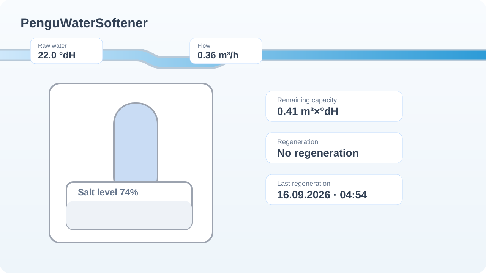

# PenguWaterSoftener

<p align="center">
  
</p>

A visual Home Assistant dashboard card for **water softeners**. It is intentionally integration-agnostic: every value is optional, and only configured + usable entities are rendered.

The card follows the interaction model of **Pengu Heat Card 2.0.1**: native Home Assistant entity pickers, automatic German/English UI, multiple visual styles, clickable entities and drag-and-drop value positioning.

> **Status:** v0.1.0 is an initial preview. The card is designed to be tested with real integrations before declaring a stable 1.0 release.

<p align="center">
  
</p>

## Highlights

- Visual softener / resin column / salt-tank schematic
- Animated **current water flow**
- **Raw-water hardness** and optional **target / soft-water hardness**
- **Salt / fill-level visualization**
- Automatic handling for `%` and `0…1` level sensors
- Unit-aware full-scale calculation for `mm`, `cm`, `m`, `g`, `kg`, `ml`, `L`, `m³`
- Supports sensors that represent either **fill height** or **distance from top**
- Remaining capacity and salt range
- Regeneration state + step visualization
- Step-aware animation for:
  - Fill brine tank
  - Brining / salting
  - Slow rinse
  - Backwash
  - Rinse
- Optional consumption, capacity, maintenance and diagnostic values
- Optional mode and manual-regeneration entities
- **No entity = no value shown**
- Unavailable/unknown entities are hidden instead of showing empty placeholders
- Drag & drop for configured values in the GUI editor
- German / English automatically follows the Home Assistant language
- More-info dialog on configured values

## Supported integration approach

### Generic / automatic

Use this for any Home Assistant integration that exposes water-softener values as entities. The card does not require a specific vendor integration.

### Grünbeck softliQ

The initial parser recognizes common regeneration states seen on softliQ systems, including German names such as:

- `Keine Regeneration`
- `Salztank füllen`
- `Salzung`
- `Langsames Spülen`
- `Rückspülen`
- `Ausspülen`

The profile currently affects interpretation only; entity assignment remains explicit so the card stays robust across integration versions and naming schemes.

## Installation

### HACS custom repository

1. Open **HACS**.
2. Open **Custom repositories**.
3. Add:

   ```text
   https://github.com/Borderlane-HA/PenguWaterSoftener
   ```

4. Category: **Dashboard**.
5. Install **PenguWaterSoftener**.
6. Reload the browser if necessary.

### Manual installation

Copy `pengu-water-softener-card.js` to:

```text
/config/www/pengu-water-softener-card.js
```

Add the dashboard resource:

```yaml
url: /local/pengu-water-softener-card.js
type: module
```

## Add the card

Use the visual card picker:

**Add card → PenguWaterSoftener**

or YAML:

```yaml
type: custom:pengu-water-softener-card
title: Enthärtungsanlage
language: auto
flow_entity: sensor.water_softener_current_flow
raw_hardness_entity: sensor.water_softener_raw_water_hardness
target_hardness_entity: sensor.water_softener_soft_water_hardness
remaining_capacity_entity: sensor.water_softener_remaining_capacity
salt_level_entity: sensor.water_softener_salt_level
salt_range_entity: sensor.water_softener_salt_range
regeneration_step_entity: sensor.water_softener_regeneration_step
regeneration_progress_entity: sensor.water_softener_regeneration_progress
last_regeneration_entity: sensor.water_softener_last_regeneration
```

Every entity is optional.

## Salt / fill-level handling

The card tries to convert a level entity to a visual percentage.

It works automatically for:

- `0 … 100 %`
- unitless `0 … 1`
- entities exposing a numeric `max` / `max_value` / `maximum` / `upper` attribute

For absolute measurements such as `cm`, `m`, `kg` or `L`, configure **Full-scale value** in the GUI editor if the entity does not expose its maximum.

Example: a salt-level sensor reports `42 cm` and the full useful height is `60 cm`:

```yaml
salt_level_entity: sensor.softener_salt_height
salt_level_max: 60
salt_level_max_unit: cm
salt_level_mode: fill_height
```

If an ultrasonic sensor reports the **distance from the top**, select `distance_top` instead. The card then inverts the percentage.

## Primary values

The editor can map:

- Current flow
- Raw-water hardness
- Target / soft-water hardness
- Salt / fill level
- Salt range
- Remaining capacity

## Regeneration values

Optional:

- Regeneration active
- Current regeneration step
- Regeneration progress
- Remaining regeneration time / amount
- Last regeneration

If the regeneration-step entity contains a recognized state, the vessel animation changes direction/type automatically.

## Consumption & capacity

Optional:

- Water consumption yesterday
- Average consumption
- Peak flow
- Total consumption
- Soft-water meter
- Capacity number
- Consumed capacity rate

## Diagnostics

Optional:

- Chlorine current
- Days until next maintenance
- Last error
- Software version

## Optional controls

You can assign:

- Operating mode entity
- Manual regeneration button entity

In v0.1.0 these are shown as normal clickable values and open the Home Assistant **More info** dialog. The card intentionally does not trigger regeneration directly on a single tap.

## Drag & drop positions

Only configured values appear in the position editor. Drag them to the desired location.

The resulting coordinates are stored as percentages, for example:

```yaml
pos_flow_x: 50
pos_flow_y: 12
pos_remaining_capacity_x: 77
pos_remaining_capacity_y: 39
```

Use **Reset value positions** to restore defaults.

## Design notes

The visual design is inspired by modern water-softener apps, but it is not a copy of any manufacturer UI. It uses its own generic softener schematic so it remains suitable for different brands and integrations.

## Repository structure

```text
PenguWaterSoftener/
├── pengu-water-softener-card.js
├── dist/
│   └── pengu-water-softener-card.js
├── assets/
│   └── pengu-logo.svg
├── CHANGELOG.md
├── LICENSE
├── README.md
├── hacs.json
└── package.json
```

## License

MIT
